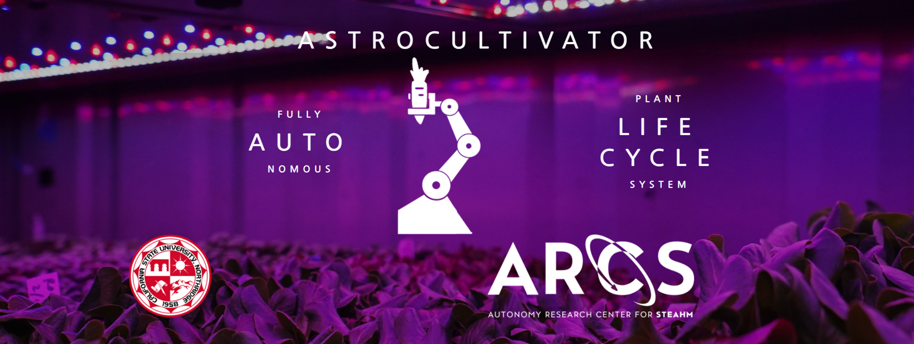

# AstroCultivators

**Contributors:** Codi Yost, Neville Elieh, Sandra Davis

---
## Overview

AstroCultivators is an autonomous farming system designed to facilitate the growth of self-pollinating crops with minimal human intervention. By incorporating features such as autonomous monitoring, real-time data reporting, environment management, automatic harvesting, and cleaning, this system aims to streamline plant growth operations and reduce the need for manual labor.

---


## Project Maintenence

- **Main**:
  - *Maintained by Neville Elieh*
  - For release or the newest version of the project.

- **Web Application**:
  - *Maintained by Sandra Davis*
  - Web interface for accessing and managing the system.

- **Sensor Data Code**:
  - *Maintained by Codi Yost*
  - Codebase responsible for collecting and processing sensor data.

--- 
## Repository Setup  
```+---.vscode
+---bme_sensor
|   \---Sensor_csv_data
+---Web Application
|   +---.idea
|   \---Front End
|       +---python scripts
|       \---Website
|           \---.vs
|               \---Website
|                   +---config
|                   +---FileContentIndex
|                   \---v17
\---WebApp_BackEnd
    \---astrocultivators_r1
        +---static
        |   \---Website
        |       \---.vs
        |           \---Website
        |               +---config
        |               +---FileContentIndex
        |               \---v17
        \---templates
```

---

## Version 2 of Web Application Frontend
*In Production*

To activate the virtual environment:

1. Navigate to the `Astrocultivator_Web_App` folder.
2. Run the following command:
.venv\Scripts\activate


To run the website in debug mode:

1. Navigate to the `Astrocultivator_Web_App` folder.
2. Run the following command:
python run.py

The website will run locally on port 5000. You can access it in any browser by typing:
localhost:5000

---
## Version 1 of Current Live Web Application

This folder contains files that are crucial for the backend server and the frontend display. Contains files including images and templates.
1. Navigate to the `/AstroCultivators/WebApp_BackEnd/astrocultivators_r1` folder.
2. Run the following command:
   python astrocultivators_web.py

The website will be live on the web via the Jetson Orin's IP address.

---
## BME_Sensor
The contents of this folder pertains to all operations of the BME Sensor. Contains code on gathering sensor data, code that converts sensor data into a viewable CSV file (bound to change).

   1. Navigate to `BME_Sensor` folder.
        
   You will find python scripts for the sensor, sensor data, sample data, and notes.
